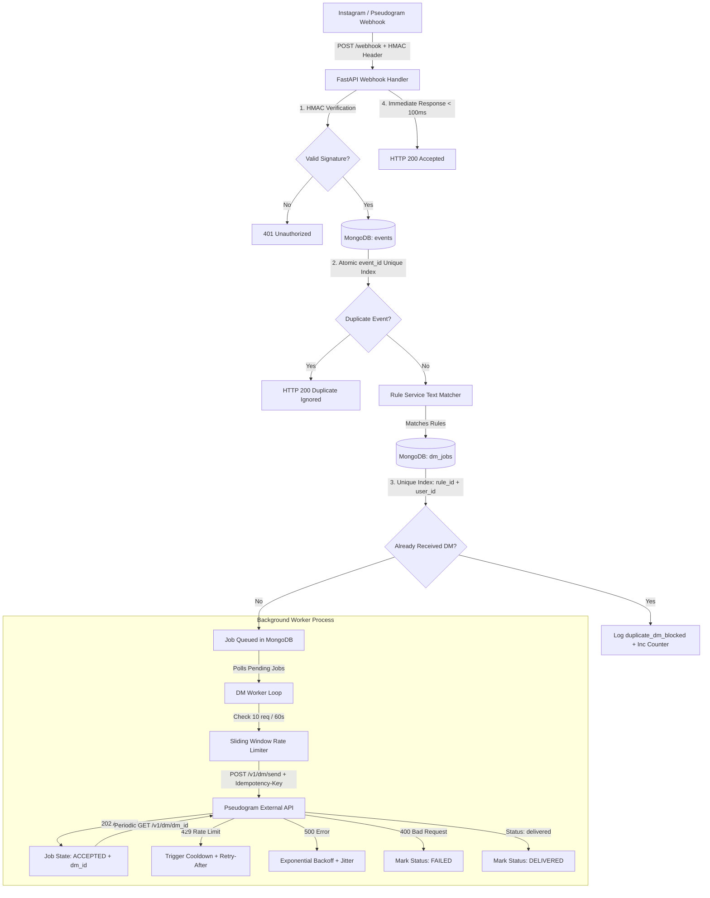

# LinkPlease Tech Intern Assignment — Production-Quality Backend

A robust, reliable, and production-ready Instagram comment automation backend built with **Python 3.12**, **FastAPI**, and **MongoDB**. The system ingests webhooks, matches rules, deduplicates events and user DMs at the database level, enforces rate limits, handles exponential backoff retries with jitter, reconciles delivery statuses, and exposes real-time statistics.

---

## Part A / B / C Completion Status

| Feature / Part | Status | Description |
| :--- | :---: | :--- |
| **Part A: Core Automation** | ✅ **COMPLETE** | `/rules`, `/webhook`, case-insensitive substring keyword matching, MongoDB persistence, duplicate event & DM prevention, background worker, retries, rate limiting, `/stats`. |
| **Part B: Signature & Concurrency** | ✅ **COMPLETE** | Raw body HMAC-SHA256 signature verification (`X-PseudoGram-Signature`), database unique constraints `(rule_id, user_id)` and `event_id`, concurrent load safety. |
| **Part C: Reconciliation & Advanced** | ✅ **COMPLETE** | 202 Accepted status tracking, periodic `GET /v1/dm/{dm_id}` reconciliation, `comment.deleted` event handling, persistent restart recovery, 500-event load test. |

---

## Architecture & Flow Diagram



---

## Technology Stack

- **Framework**: Python 3.12, FastAPI
- **Database**: MongoDB (Motor async driver & PyMongo)
- **Validation & Settings**: Pydantic v2 & Pydantic-Settings
- **HTTP Client**: `httpx` (async HTTP client with timeouts)
- **Testing**: `pytest`, `pytest-asyncio`, `respx`
- **Containerization**: Docker, Docker Compose

---

## Setup & Running Locally

### Prerequisites
- Python 3.12+
- MongoDB instance running locally on `mongodb://localhost:27017` (or Docker)

### 1. Clone & Environment Setup
```bash
cp .env.example .env
python -m venv venv
# On Windows PowerShell:
.\venv\Scripts\Activate.ps1
# On Linux/macOS:
source venv/bin/activate

pip install -r requirements.txt
```

### 2. Environment Variables (`.env`)
```env
PSEUDOGRAM_API_KEY=mock_api_key_test
PSEUDOGRAM_BASE_URL=https://pseudogram-api.onrender.com
MONGODB_URI=mongodb://localhost:27017
DATABASE_NAME=linkplease
MAX_RETRIES=5
WEBHOOK_SIGNATURE_REQUIRED=true
RATE_LIMIT_REQUESTS=10
RATE_LIMIT_WINDOW_SECONDS=60
```

### 3. Start Application
```bash
uvicorn app.main:app --reload --port 8000
```
Swagger API docs will be available at: [http://localhost:8000/docs](http://localhost:8000/docs)

---

## Running with Docker Compose

```bash
docker compose up --build
```

---

## Running Tests

Execute full test suite including unit, integration, retry, rate limit, and reconciliation tests:
```bash
pytest
```

Run the 500-event / 10-second load test:
```bash
python -m tests.test_load_500
```

---

## API Endpoints & Example `curl` Commands

### 1. Create Automation Rule (`POST /rules`)
```bash
curl -X POST "http://localhost:8000/rules" \
  -H "Content-Type: application/json" \
  -d '{
    "keyword": "PRICE",
    "dm_message": "Here is our pricing catalog: https://example.com/pricing"
  }'
```
**Response (201 Created)**:
```json
{
  "rule_id": "rule_a1b2c3d4e5",
  "keyword": "PRICE",
  "dm_message": "Here is our pricing catalog: https://example.com/pricing"
}
```

---

### 2. Post Webhook Event (`POST /webhook`)
*(Note: If `WEBHOOK_SIGNATURE_REQUIRED=true`, attach header `X-PseudoGram-Signature: sha256=<hex_hmac>`)*
```bash
curl -X POST "http://localhost:8000/webhook" \
  -H "Content-Type: application/json" \
  -H "X-PseudoGram-Signature: sha256=your_calculated_hmac" \
  -d '{
    "event_id": "evt_01J8ZQ4K2N7RXA",
    "event_type": "comment.created",
    "sent_at": "2026-08-10T09:14:22.481Z",
    "data": {
      "comment_id": "cmt_9f2a7c",
      "post_id": "post_44de1b",
      "text": "PRICE please 🙏",
      "created_at": "2026-08-10T09:14:21.900Z",
      "from": {
        "user_id": "usr_3b91fe",
        "username": "arjun.shoots"
      }
    }
  }'
```
**Response (200 OK)**:
```json
{
  "status": "accepted"
}
```

---

### 3. Get Real-Time Statistics (`GET /stats`)
```bash
curl -X GET "http://localhost:8000/stats"
```
**Response (200 OK)**:
```json
{
  "sent": 142,
  "failed": 3,
  "queued": 8,
  "duplicates_blocked": 57
}
```

---

## Architectural Deep Dive & Key Concepts

### 1. Webhook Idempotency
- Unique MongoDB index on `events.event_id`.
- Duplicate deliveries raise `pymongo.errors.DuplicateKeyError`, which is handled gracefully, returning HTTP 200 without duplicate processing.

### 2. Duplicate DM Prevention
- Unique compound MongoDB index on `dm_jobs.(rule_id, user_id)`.
- Enforces atomic deduplication at the database level. If two concurrent workers attempt to insert a job for the same user and rule, one succeeds and the second fails atomically, recording a `duplicates_blocked` entry.

### 3. Rate Limiting Strategy
- Application-side sliding window rate limiter (`AsyncRateLimiter`) guarantees that outbound calls to Pseudogram remain below 10 requests per rolling 60 seconds.
- Respects `Retry-After` headers on 429 responses.

### 4. Exponential Backoff Retry Policy
- HTTP 500 and network errors trigger retries up to `MAX_RETRIES=5`.
- Delay formula: `min(max_delay, 2^(attempt - 1)) + uniform(0, 1)`.

### 5. Delivery Reconciliation (Part C)
- 202 Accepted responses store `dm_id` and mark status as `accepted`.
- Worker periodically polls `GET /v1/dm/{dm_id}` until remote status transitions to `delivered` or `failed`.

---

## Interview Explanation Section

### 1. Why FastAPI?
FastAPI provides native `async/await` support essential for handling thousands of concurrent webhooks, high-performance Pydantic v2 validation, automatically generated OpenAPI documentation (`/docs`), and lightweight overhead compared to Django or Flask.

### 2. Why MongoDB?
MongoDB allows flexible JSON document storage matching webhook events natively, supports compound unique indexes (`rule_id + user_id`) for concurrency control, and Motor provides asynchronous non-blocking driver integration with FastAPI.

### 3. Why background processing?
Webhooks must respond within seconds (per spec < 5s). Performing slow external HTTP requests (which may face 429 rate limits or 500 delays) synchronously inside the request loop would cause timeouts and block client threads. Ingesting into MongoDB and returning HTTP 200 immediately decouples ingestion from execution.

### 4. How is duplicate processing prevented?
We rely on database-level unique constraints:
1. `event_id` unique index on `events` collection.
2. Compound unique index `(rule_id, user_id)` on `dm_jobs` collection.
Database constraints guarantee atomicity even when multiple workers or API instances execute concurrently.

### 5. How is rate limiting handled?
An in-memory sliding window `AsyncRateLimiter` enforces a maximum of 10 outbound requests per 60 seconds. If an HTTP 429 is encountered, the worker reads `Retry-After` and applies a global cooldown pause.

### 6. How are retries handled?
Failed 500 or timeout requests calculate exponential backoff with random jitter (`2^attempt + jitter`) and update `next_attempt_at` in MongoDB. If attempt count reaches `MAX_RETRIES=5`, the job status transitions to `FAILED`.

### 7. Why isn't 202 counted as delivered?
HTTP 202 means "Accepted for processing", not delivered. Instagram/Pseudogram queues the DM asynchronously. Counting 202 as delivered would inflate statistics with undelivered messages.

### 8. What happens if the application crashes?
All state is persisted in MongoDB. Upon restart, the background worker queries MongoDB for any jobs in `QUEUED`, `RETRYING`, or `ACCEPTED` status and resumes processing cleanly.

### 9. What are the remaining failure modes?
Documented in detail in [`FAILURES.md`](file:///c:/Users/borru/OneDrive/Desktop/4thyear/LinkPlease/FAILURES.md) (e.g. process crash before database write, in-flight HTTP requests during comment deletion).
